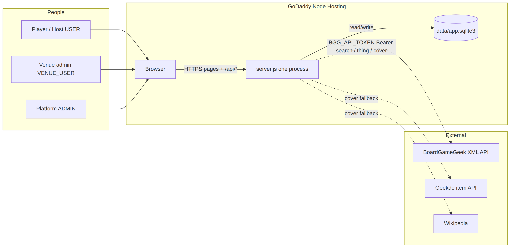
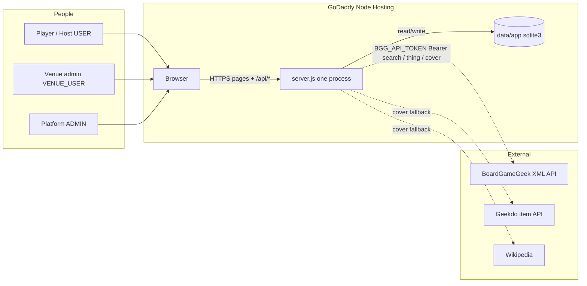
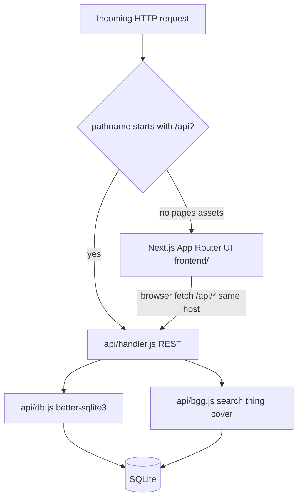
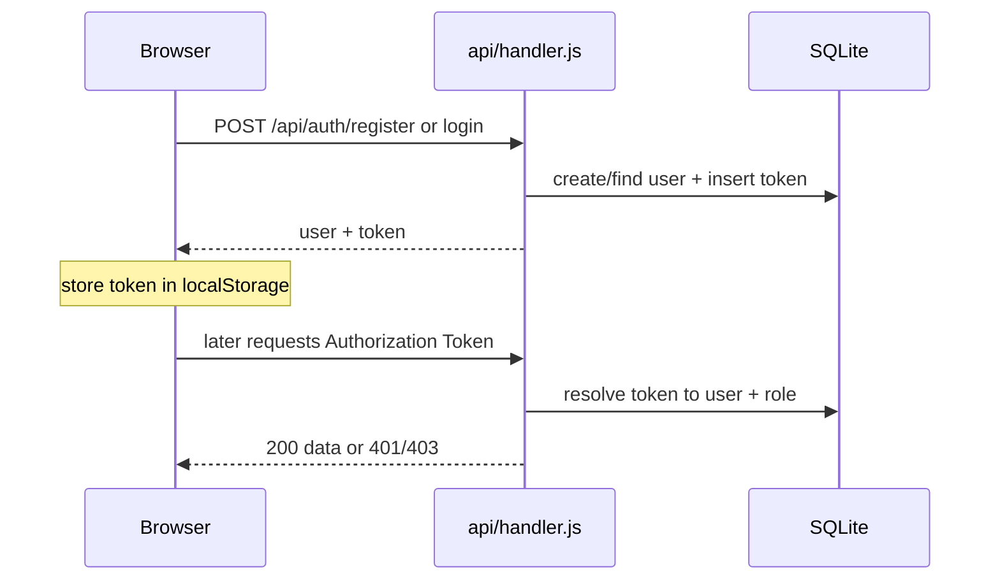
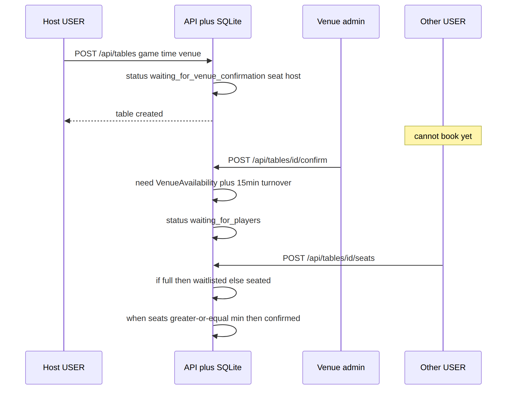
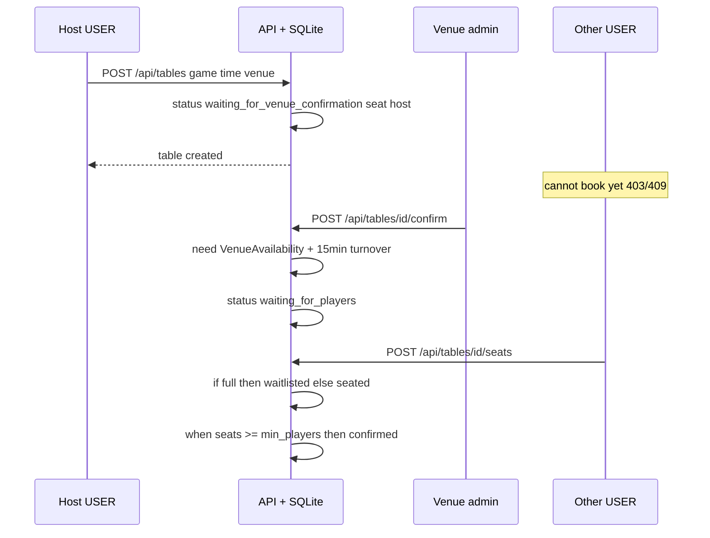
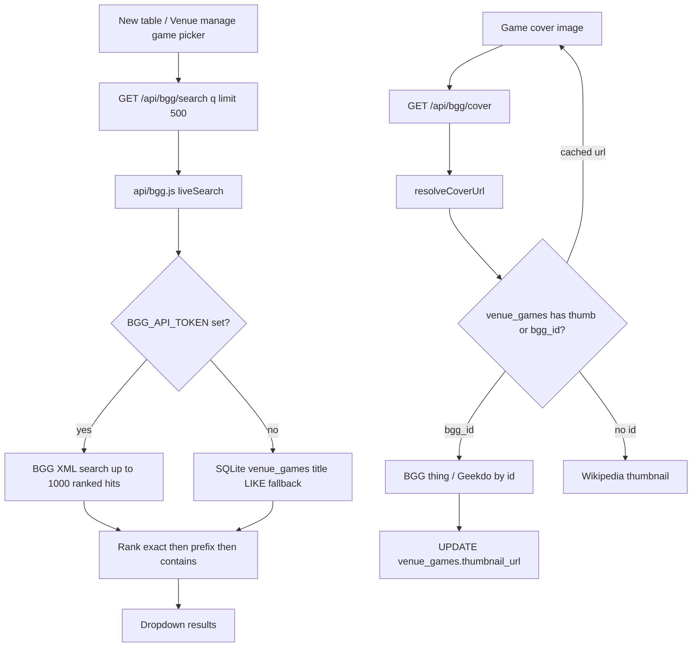
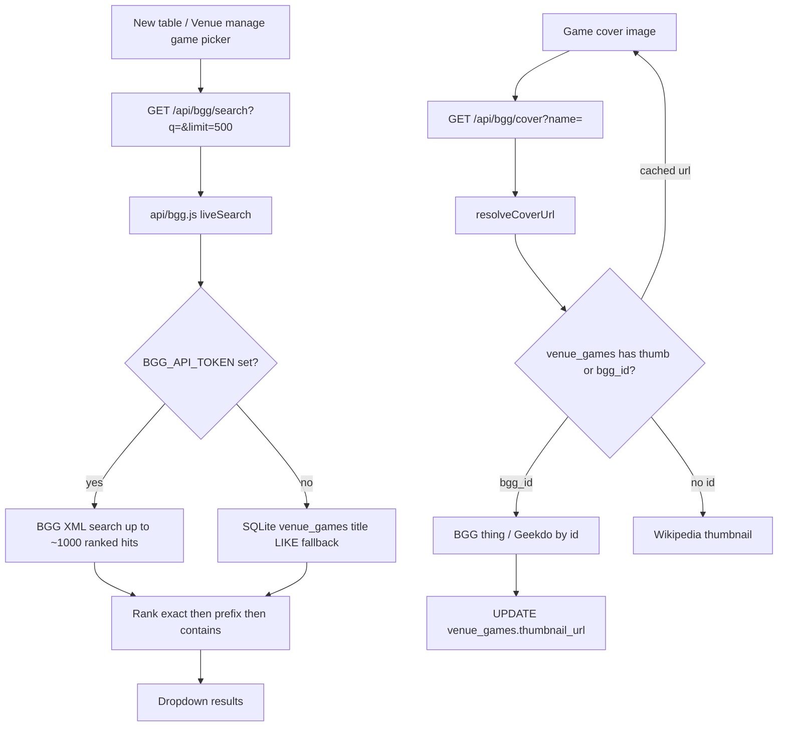
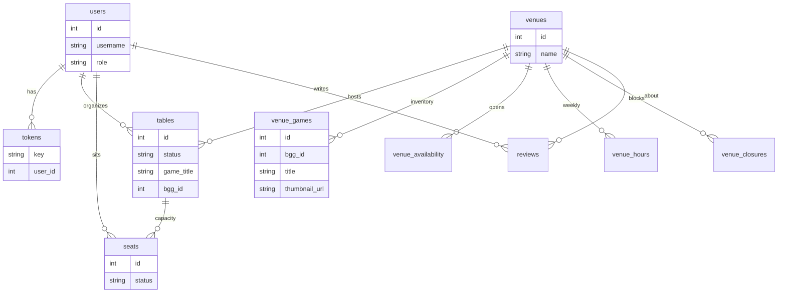
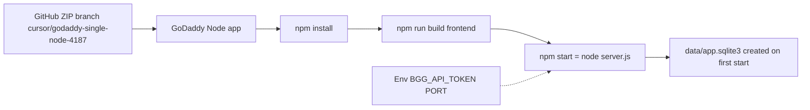

# Architecture picture (production GoDaddy deploy)

This document is the **visual map of what we actually run today** on GoDaddy:
one Node process that serves the Next.js UI and an embedded REST API over SQLite.

The older target design (Django + PostgreSQL modular monolith) remains in
`docs/Architecture.md`. Prefer **this file** when reasoning about the live app,
deploy ZIP, BGG search/covers, and request flows.

Rendered PNGs (same diagrams): [`docs/architecture/`](./architecture/).

---

## 1. Big picture — who talks to what

**Why this shape**

| Choice | Why |
|--------|-----|
| One Node process | GoDaddy Node hosting is one app; no second Django dyno or `BACKEND_URL` |
| SQLite file on disk | No managed Postgres required; DB appears on first `npm start` |
| Same origin `/api/*` | Browser calls relative `/api/...`; no CORS, no reverse-proxy rewrite to Django |
| BGG as external | Game catalog + covers live on BGG; we cache thumbs on `venue_games` when we can |

---

## 2. Inside the process — request routing

**Entry:** `server.js` creates one `http.Server`.

1. `/api` or `/api/...` → `handleApi` in `api/handler.js`
2. Everything else → Next.js request handler (`frontend/`)

Frontend `api.ts` calls `/api/...` with optional `Authorization: Token <key>`.
BGG routes get a longer client timeout (25s) because search XML can be large.

---

## 3. Auth flow — how identity moves

Roles enforced in the API (not only in the UI):

- **USER** — host tables, reserve seats
- **VENUE_USER** — confirm/reject tables, manage venue games/hours (cannot host/reserve as a player)
- **ADMIN** — both worlds

---

## 4. Core domain — create table → venue confirm → seats

**Why these gates exist**

| Rule | Why |
|------|-----|
| Start as `waiting_for_venue_confirmation` | Venue must accept the booking before strangers fill seats |
| Availability + 15‑minute turnover | Prevents overlapping tables at the same venue |
| Waitlist instead of hard reject | Full tables still capture demand; cancel promotes next waitlisted seat |

---

## 5. BGG — search dropdown + covers

**Why search was “missing” games like ICE**

BGG can return hundreds of hits for a short query. An old hard cap (~40) dropped
exact titles that sorted late. Today we request up to **500** (API max **1000**)
and **rank exact/prefix matches first**.

**Why covers must not search on every image**

Calling live BGG search from `/api/bgg/cover` for each card hammered BGG and
starved the Node process (timeouts on login/API). Covers now use a known
`bgg_id` / cached thumb, then Geekdo/Wikipedia — not a fresh search per pixel.

---

## 6. Data at rest — SQLite tables that matter

---

## 7. Deploy shape (what goes on GoDaddy)

**Not on GoDaddy:** Django `backend/`, Postgres, `BACKEND_URL` proxy.

**Still in the monorepo for history/local experiments:** `backend/` (Django). The
production ZIP / start path is the Node stack above.

---

## 8. Mental model in one sentence

**Browser → `server.js` → either Next.js pages or `api/handler.js` → SQLite for app
state, BoardGameGeek (with token) for game search/metadata/covers.**

Roles and table-status rules live in the API so the UI cannot bypass venue
confirmation or seat capacity.
