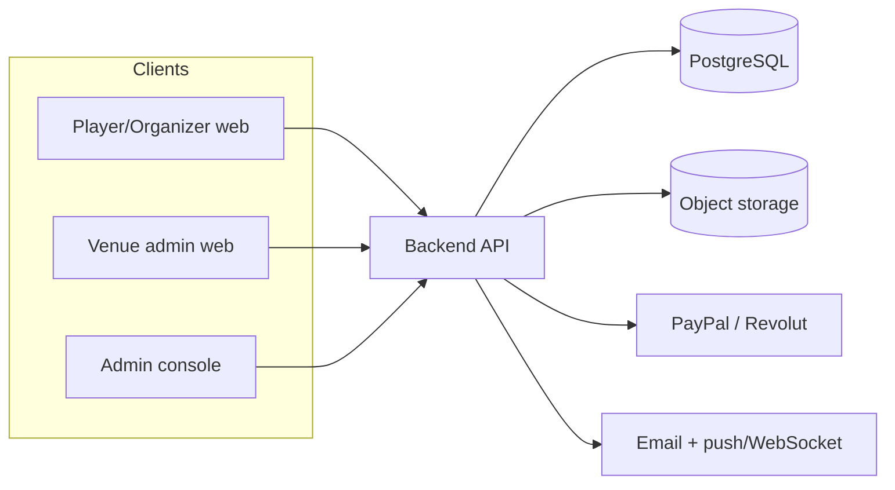
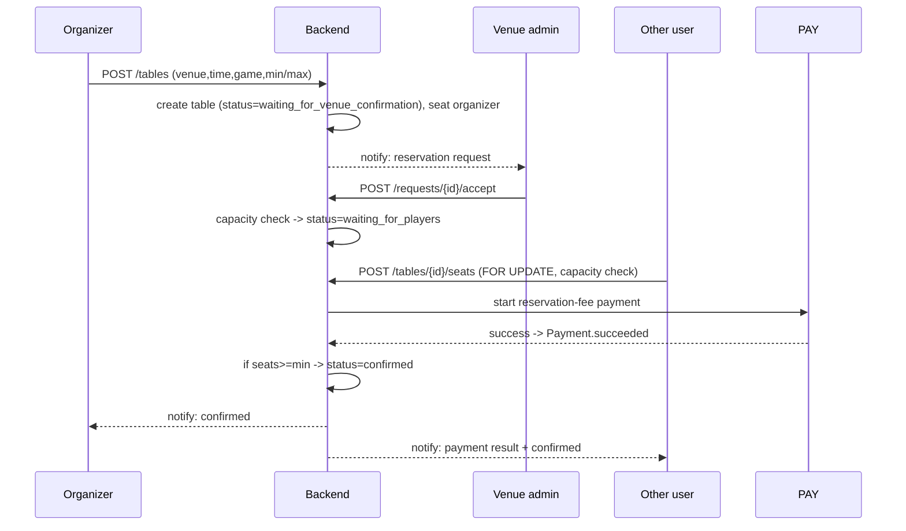
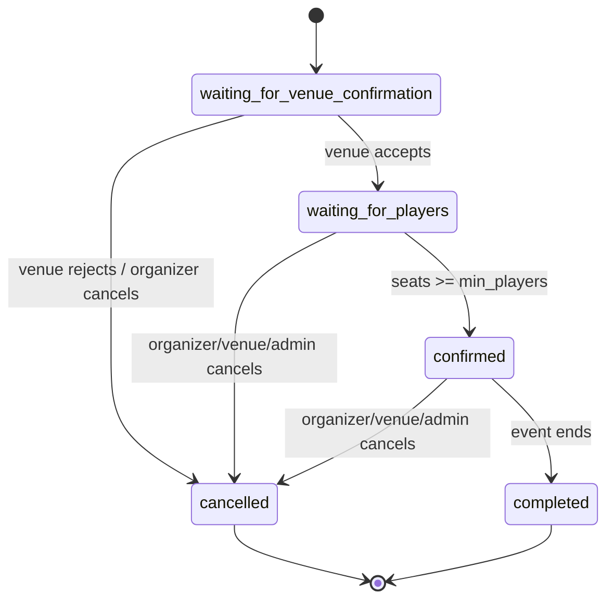

# Architecture

## Overview

BoardGameReservationApp is split into a backend API and client apps for three audiences: **players/organizers**, **venue admins**, and the **platform admin**. The backend owns all business rules (table lifecycle, capacity, payments, moderation) and integrates with external payment and notification providers.

This reflects the table/venue model in `docs/Vision.md`, `docs/UserStories.md`, and `docs/Requirements.md`.

## System style

The backend is a **modular monolith** (single deployable, clear internal modules: auth, venues, tables, payments, social, moderation, notifications) over **PostgreSQL**, with object storage for media (see `ADR-010`). This keeps seat/payment invariants inside local DB transactions and defers service decomposition until it is actually needed.

For the MVP, the three clients can be one responsive web app with role-based views; native mobile can follow.

## Components

### Backend API

- Owns business rules for tables (events), seat reservations, venue capacity, and the table status lifecycle (see `ADR-007`)
- Enforces the role/permission matrix from `docs/Permissions.md` server-side (`USER`, `VENUE_USER`, `ADMIN`)
- Exposes REST endpoints for auth, venues, tables/seats, games, reviews, friends, chat, payments, reports, and notifications (see `docs/API.md`)
- Persists data in a relational database (see `docs/Database.md`)
- Integrates with payment providers (PayPal, Revolut) and a notification service (email + in-app)
- Stores images (avatars, venue/event/game photos) in object storage

### Player / Organizer Client (mobile / web)

- Browse and filter tables and venues; create tables; reserve seats *(1, 2, 3, 13)*
- Manage friends, invitations, event chat, reviews, and profile/avatar *(5, 8, 14, 16, 20)*
- Pay reservation fees and view payment/notification status *(30, 32, 33)*

### Venue Admin Client

- Manage venue profile, availability/capacity, rules, and game inventory *(34, 36, 44, 45)*
- Accept/reject reservation requests; view all events at the venue in one place *(35, 41)*
- Respond to reviews; block abusive users at the venue *(37, 42)*

### Admin Console

- Full `USER` + `VENUE_USER` capabilities plus global management of venues, venue admins, and the game catalog *(46, 47)*
- Moderation: review reports, delete abusive content, block users/venues, mark super users/locations *(48, 49, 53, 54)*
- Fee reporting per venue/user/game *(50, 51)*

## High-Level Flow (create & confirm a table)

1. Organizer creates a table at a venue (time, duration, min/max players, game or bring-own, language); a seat is reserved for them by default. *(1, 4)*
2. The request goes to the venue; table status is `waiting for venue confirmation`. *(33)*
3. Venue admin accepts (or rejects) the reservation request; on accept, status becomes `waiting for players`. *(24, 35)*
4. Other users browse/filter, reserve seats, and (optionally) pay the reservation fee. *(2, 30)*
5. When enough seats fill, status becomes `confirmed`; relevant users are notified. *(28, 33)*
6. Cancellations (by attendee up to 24h before, or by organizer/venue) trigger notifications and automatic refunds. *(21, 22, 25, 31)*
7. After the event, participants can add photos and write reviews. *(5, 7)*

## Table status lifecycle (ADR-007)

## Concurrency & integrity

Trustworthy availability (per `docs/Vision.md`) depends on two backend-enforced invariants (see `ADR-011` and `docs/Database.md`):

- **No seat over-booking** — reserving a seat locks the `Table` row (`SELECT ... FOR UPDATE`), verifies `seats_taken < max_players`, inserts the `SeatReservation`, and increments the counter. A partial unique index on `SeatReservation(table_id, user_id)` blocks duplicate joins. Conflicts return `409`.
- **No venue over-capacity** — venue confirmation checks overlapping tables against `VenueAvailability.tables_available` for the requested slot. Conflicts return `409`.

## Design Notes

- Capacity and the table status lifecycle are enforced at the API/database layer, not only in the UI (per `docs/Permissions.md` and `ADR-002`).
- Notifications are scoped to relevance (only tables a user organizes or joined) to avoid spam. *(28)*
- Payments use hosted provider flows; the app never stores card data (see `ADR-006`).
- Moderation, blocks, cancellations, and refunds are auditable.
