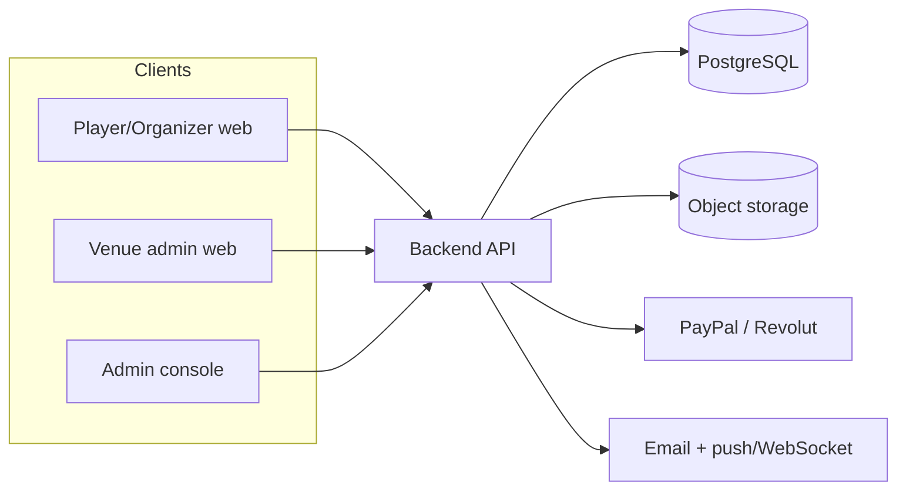
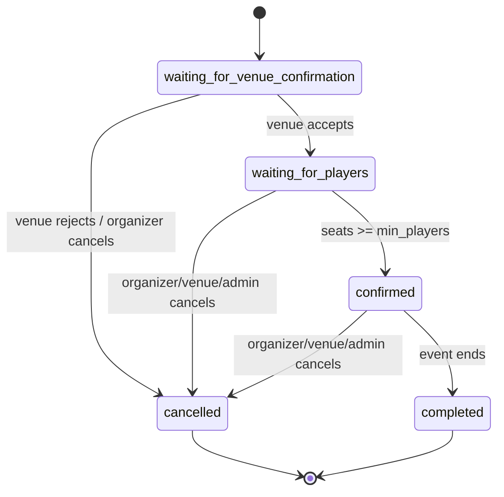

# Architecture

## Overview

BoardGameReservationApp is split into a backend API and client apps for three audiences: **players/organizers**, **venue admins**, and the **platform admin**. The backend owns all business rules (table lifecycle, capacity, payments, moderation) and integrates with external payment and notification providers.

This reflects the table/venue model in `docs/Vision.md`, `docs/UserStories.md`, and `docs/Requirements.md`.

## System style

The backend is a **modular monolith** (single deployable, clear internal modules: auth, venues, tables, payments, social, moderation, notifications) over **PostgreSQL**, with object storage for media (see `ADR-010`). This keeps seat/payment invariants inside local DB transactions and defers service decomposition until it is actually needed.

```mermaid
flowchart LR
    subgraph Clients
      P[Player/Organizer web]
      V[Venue admin web]
      A[Admin console]
    end
    P --> API[Backend API]
    V --> API
    A --> API
    API --> DB[(PostgreSQL)]
    API --> OBJ[(Object storage)]
    API --> PAY[PayPal / Revolut]
    API --> NOTIF[Email + push/WebSocket]
```

### Launch client: mobile-first responsive web (ADR-012)

The launch client is a **single responsive web app** with role-based views (player/organizer, venue admin, admin). It is **mobile-first**: it must look and work excellently on phones from day one (the primary target), while scaling up gracefully to tablet/desktop. Native mobile apps may follow later and reuse the same backend API.

- Design and build phone-first (small viewport as the default), then enhance for larger screens.
- Touch-friendly targets, fast first load, and readable layouts on narrow screens are launch requirements (see `NFR-6`).
- No native app is required for launch; the responsive website is the product on phones.

## Components

### Backend API

- Owns business rules for tables (events), seat reservations, venue capacity, and the table status lifecycle (see `ADR-007`)
- Enforces the role/permission matrix from `docs/Permissions.md` server-side (`USER`, `VENUE_USER`, `ADMIN`)
- Exposes REST endpoints for auth, venues, tables/seats, games, reviews, friends, chat, payments, reports, and notifications (see `docs/API.md`)
- Persists data in a relational database (see `docs/Database.md`)
- Integrates with payment providers (PayPal, Revolut) and a notification service (email + in-app)
- Stores images (avatars, venue/event/game photos) in object storage

### Player / Organizer Client (mobile / web)

- Browse and filter tables and venues; create tables; reserve seats *(1, 2, 3, 13)*
- Manage friends, invitations, event chat, reviews, and profile/avatar *(5, 8, 14, 16, 20)*
- Pay reservation fees and view payment/notification status *(30, 32, 33)*

### Venue Admin Client

- Manage venue profile, availability/capacity, rules, and game inventory *(34, 36, 44, 45)*
- Accept/reject reservation requests; view all events at the venue in one place *(35, 41)*
- Respond to reviews; block abusive users at the venue *(37, 42)*

### Admin Console

- Full `USER` + `VENUE_USER` capabilities plus global management of venues, venue admins, and the game catalog *(46, 47)*
- Moderation: review reports, delete abusive content, block users/venues, mark super users/locations *(48, 49, 53, 54)*
- Fee reporting per venue/user/game *(50, 51)*

## High-Level Flow (create & confirm a table)

1. A `USER` (host) creates a table at a venue (date, from/to time, min/max players, game with bring-own + language or a venue game); the host's seat is reserved by default. *(1, 4; decisions 4, 6)*
2. The request goes to the venue; table status is `waiting for venue confirmation`. **No other user can book yet.** *(33; decision 2)*
3. Venue admin accepts (confirming table availability, and the requested game if it is a venue game) or rejects; on accept, status becomes `waiting for players`. *(24, 35; decisions 2, 4)*
4. Only now do other `USER`s browse/filter, reserve seats (or join the **waitlist** if full), and pay the fee (full-table by host, or per-seat). *(2, 30; decisions 1, 6, 7)*
5. When enough seats fill, status becomes `confirmed`; relevant users are notified. *(28, 33)*
6. Cancellations trigger notifications and automatic refunds; a within-24h cancellation is *late* (30-day profile mark) and a reserved-seat cancellation **promotes the next waitlisted user**. *(21, 22, 25, 31; decision 7)*
7. After the event, participants can add photos and write reviews. *(5, 7)*

```mermaid
sequenceDiagram
    participant O as Organizer
    participant API as Backend
    participant VA as Venue admin
    participant U as Other user
    O->>API: POST /tables (venue,time,game,min/max)
    API->>API: create table (status=waiting_for_venue_confirmation), seat organizer
    API-->>VA: notify: reservation request
    VA->>API: POST /requests/{id}/accept (confirm table + venue game)
    API->>API: capacity check -> status=waiting_for_players
    U->>API: POST /tables/{id}/seats (FOR UPDATE; if full -> waitlisted)
    API->>PAY: start reservation-fee payment
    PAY-->>API: success -> Payment.succeeded
    API->>API: if seats>=min -> status=confirmed
    API-->>O: notify: confirmed
    API-->>U: notify: payment result + confirmed
```

## Table status lifecycle (ADR-007)

```mermaid
stateDiagram-v2
    [*] --> waiting_for_venue_confirmation
    waiting_for_venue_confirmation --> waiting_for_players: venue accepts
    waiting_for_venue_confirmation --> cancelled: venue rejects / organizer cancels
    waiting_for_players --> confirmed: seats >= min_players
    waiting_for_players --> cancelled: organizer/venue/admin cancels
    confirmed --> completed: event ends
    confirmed --> cancelled: organizer/venue/admin cancels
    cancelled --> [*]
    completed --> [*]
```

## Concurrency & integrity

Trustworthy availability (per `docs/Vision.md`) depends on backend-enforced invariants (see `ADR-011`, `ADR-013`, and `docs/Database.md`):

- **No seat over-booking** — reserving a seat locks the `Table` row (`SELECT ... FOR UPDATE`), verifies `seats_taken < max_players`, inserts the `SeatReservation`, and increments the counter. A partial unique index on `SeatReservation(table_id, user_id)` blocks duplicate joins. When full, the user is **waitlisted** rather than rejected.
- **No venue over-capacity + 15-min turnover** — venue confirmation counts tables whose `[starts_at, ends_at]` windows fall within **15 minutes** of the requested slot against `VenueAvailability.tables_available`; slots start ≥15 min apart. Conflicts return `409`. *(decision 3)*
- **Waitlist promotion & late marks** — cancelling a reserved seat promotes the earliest waitlisted user in the same transaction; a within-24h cancellation records a 30-day `LateCancellationMark`. *(decision 7)*

## Design Notes

- Capacity and the table status lifecycle are enforced at the API/database layer, not only in the UI (per `docs/Permissions.md` and `ADR-002`).
- Notifications are scoped to relevance (only tables a user organizes or joined) to avoid spam. *(28)*
- Payments use hosted provider flows; the app never stores card data (see `ADR-006`).
- Moderation, blocks, cancellations, and refunds are auditable.
